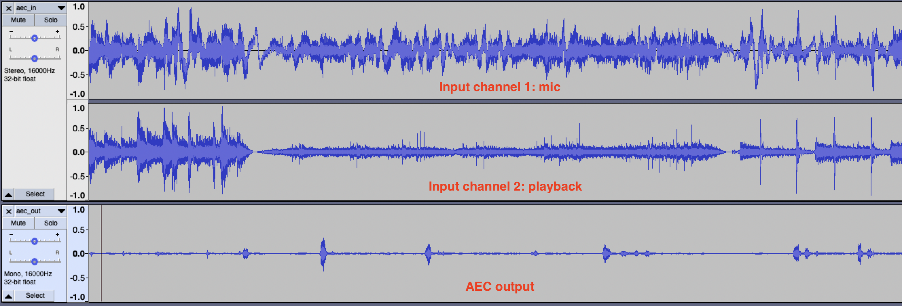

# PiDTLN

The target of this project is to integrate and use two amazing pretrained models [DTLN](https://github.com/breizhn/DTLN) and [DTLN-aec](https://github.com/breizhn/DTLN-aec) on Raspberry Pi for realtime noise suppression (NS) and/or acoustic echo cancellation (AEC) tasks.

# Noise Suppression with DTLN

This is simple as the [DTLN](https://github.com/breizhn/DTLN) project already provides a realtime script for handling data from/to audio devices.
I add a few useful options in the `ns.py` based on the orginal script. See `--help` for details.

## Setup

### Configure Loopback and Test DTLN
  * Enable `snd-aloop` with `sudo modprobe snd_aloop`. You may want to add a line `snd-aloop` in `/etc/modules` to automatically enable it on boot.
  * Now check `arecord -l`, you should able to see two new Loopback devices.
  * Run DTLN with `python3 ns.py -o 'Loopback ,0' --measure`, you should see processing times < 4ms. If your processing time is longer you may need a more powerful device. If you see a lot of "input underflow" try to adjust the latency for a higher value, e.g., `--latency 0.5`.
  * Run `arecord -D hw:Loopback,1 -f float_le -r 16000 -c 1 -V mono rec.wav` in a separate shell to record denoised audio. Then listen to it or open with Audacity. You should noice obvious noise removal and clear voice.

### Setup DTLN as a Service
  * Copy `ns.py` to `/usr/local/bin/ns` and `chmod +x`.
  * Add the `dtln_ns.service` to `/etc/systemd/user/` and enable it with `systemctl --global enable dtln_ns`
  * Reboot and record some audio from `hw:Loopback,1` to see if DTLN NS is running and taking effect.

# Acoustic Echo Cancellation

This is based on the [DTLN-aec](https://github.com/breizhn/DTLN-aec) project. It currently only has a file-based demo script with tflite (not quantized) models. To make it realtime, I converted models to quantized models and created two realtime scripts:
* `models/dtln_aec_???_quant*` are quantized models. `???` is the number of LSTM units, larger means slower but supposed to be better.
* `aec.py` takes a pair of devices as input and output. It assumes the input device contains a channel as loopback/reference.
* `aec_mp.py` is a multiprocessing version, it runs close to 2x faster on 256/512 models.

## Setup with Hardware Loopback

You need to have a sound card which supports hardware loopback, and the loopback is on the last channel of captured audio. In my case is the [Respeaker USB Mic Array V2.0](https://wiki.seeedstudio.com/ReSpeaker_Mic_Array_v2.0/), which has 6 input channels and the last one is the playback loopback.

1. List devices with `python3 ns.py -l`. Note down a unique substring of your soundcard's name. In my case it can be "UAC1.0".
2. Test with `python3 ns.py -i UAC1.0 -o UAC1.0 -c 6 -m 128`. Speak to your mic, you should hear no feedback echo.
3. Follow the similar procedure in DTLN NS setup to put AEC output to a virtual capturing device. So you can use it in other programs.

## Setup without Hardware Loopback

When you don't have a soundcard that supports hardware loopback, you need to create a virtual input device whose last channel stores playback loopback. I made a [ALSA AEC plugin](configs/aec_asound.conf) that can achieve this. Copy the file to `/etc/alsa/alsa.conf/50-aec.conf`. Then you will have two additional alsa interfaces: `aec` and `aec_internal`. To use them, simply do:
1. Play some music to AEC virtual device: `aplay -D aec:cardname music.wav`
2. Run AEC script with: `python3 aec.py -m 128 -i aec_internal:cardname -o aec_internal:cardname`.
3. Record from AEC virtual device: `arecord -D aec:cardname -f S16_LE -r 16000 -c 1 -V mono rec.wav`

Now look at recorded audio file, music should be removed. 
For testing, you may also use the `--save` option to save input audio to `/tmp/aec_in.wav` and AEC output to `/tmp/aec_out.wav` for inspection. Below is an sample input/output with my [ReSpeaker 2-Mics Pi HAT](https://wiki.seeedstudio.com/ReSpeaker_2_Mics_Pi_HAT/) (run with 256 model).

## Performance

This table is the evaluation of processing time on my Raspberry Pi 3B+ with 64bit OS. Note that all DTLN models were trained with block of 128 samples. Under the sample rate 16000, that is 8ms. So the processing time must be below 8ms to work realtime.

| Model | `ns.py` | `aec.py` | `aec_mp.py` |
| ----- | ------- | -------- | ----------- |
| 128   | N/A     | 4.43 ms  | 3.49 ms     |
| 256   | N/A     | 6.36 ms  | 4.70 ms     |
| 512   | 2.56 ms | 12.35 ms | 8.48 ms     |

In my experience, it's better to use models < 5ms, otherwise you may see some "output underflow" messages (sometimes increase `--latency` may help).

## Additional Notes
* The `aec_mp.py` script uses `multiprocessing.shared_memory`, which requires Python 3.8+. If you are using an older version of Python, please do `pip3 install shared-memory38` first to install the backport module.
* If `pyfftw` is installed, the script will use `pyfftw` instead of `np.fft`, which can gives a negligible ~0.2ms speedup. Note that in `aec_mp.py`, the processing time is capped by `interpreter2` inference time so fft processing time in the parallel process doesn't matter.
* One huge benefit of DTLN AEC comparing to traditional AEC is that it's more robust. It can work even when the input has gone through other preprocessing stages like NS or another AEC. Also it can adapte to different delays so you may try it with bluetooth speaker.
* The DTLN NS can also attenuate most of the background music the model is faster and more stable comparing to 128/256 AEC models. Sometimes I notice my voice is also attenuated by AEC models. So traditional (hardware) AEC + DTLN NS may work better in practice.

## Acknowledgement
* This project is heavily based on the [DTLN](https://github.com/breizhn/DTLN) and [DTLN-aec](https://github.com/breizhn/DTLN-aec) projects by [breizhn](https://github.com/breizhn).
* Thanks [StuartIanNaylor](https://github.com/StuartIanNaylor) for the discussion and help on various topics ranging from the idea of multiprocessing and trouble shooting alsa configs.
* Kudos to the cool tool [tflite2tensorflow](https://github.com/PINTO0309/tflite2tensorflow/) made by [PINTO0309](https://github.com/PINTO0309). I used it to convert DTLN-aec tflite models to quantized version.